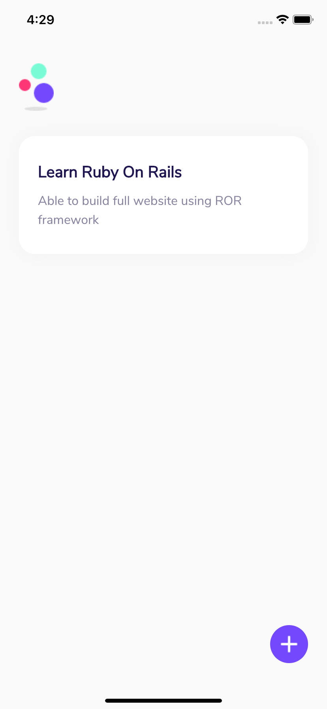

# Flutter Todo Example

Sample todo app built with Flutter

## Installations

- Install flutter
- Clone source code: `git@github.com:tranquangvu/flutter-todo.git`
- `cd flutter-todo`
- Get pubspecs: `flutter pub get`
- Start any ios/android simulator
- Run application: `flutter run`

## Screenshots

  
  
  
  

